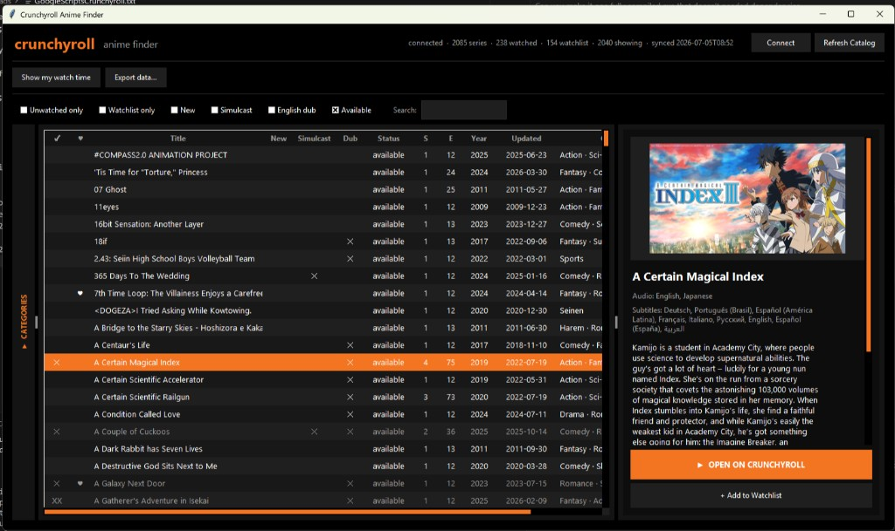
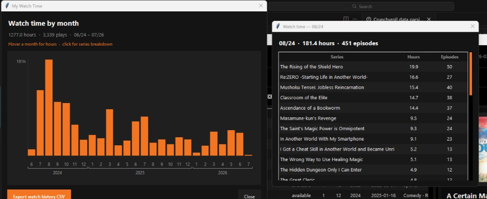
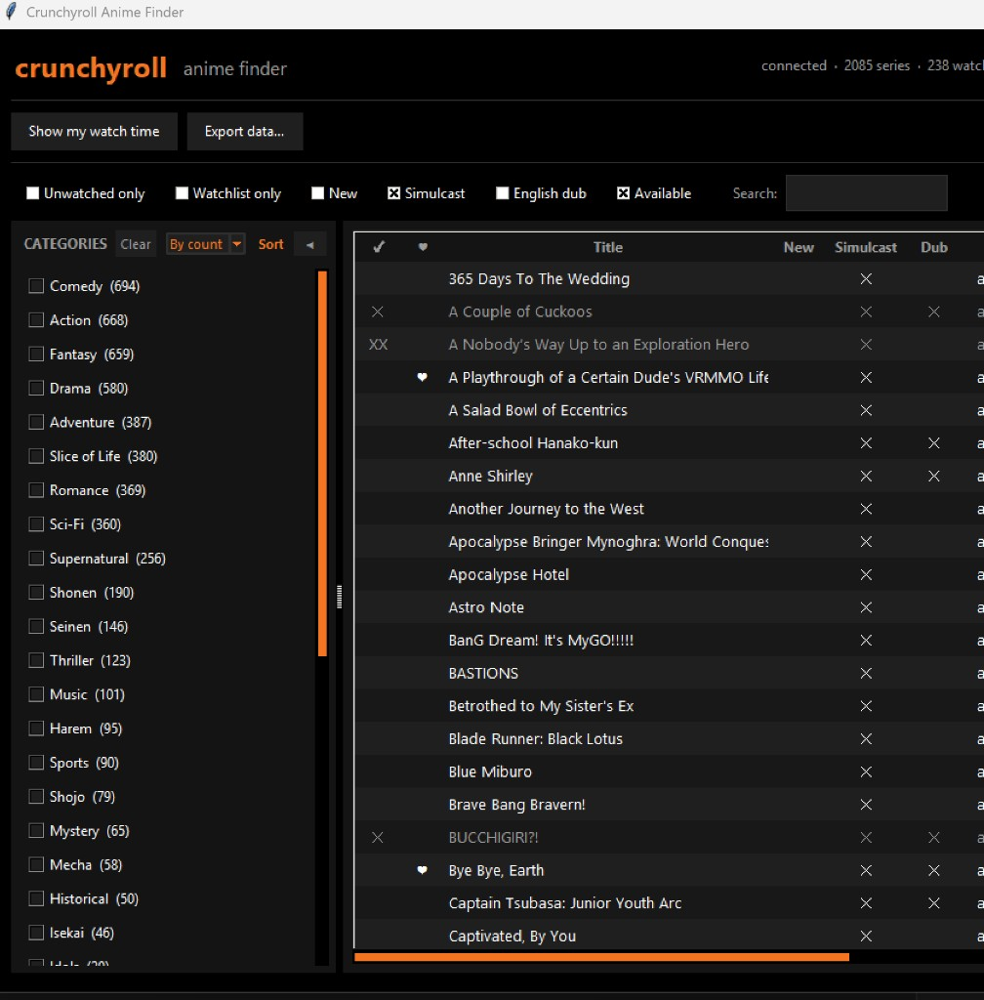

# Crunchyroll Anime Finder

A desktop app to browse Crunchyroll’s full anime catalog, filter by category, manage your watchlist, and explore your watch history — with a dark Crunchyroll-inspired UI.


---

AI Disclosure-- this project was created with the assistance of Cursor.


## Screenshots

### Main window & series detail

Browse the catalog, filter, and open series details with poster, audio/subtitles, and watchlist actions.



### Watch time chart

Monthly hours with per-series breakdown on click.



### Category filters

Collapsible category sidebar with sort by count or A–Z.



---

## Features

- **Full catalog** — paginated browse (~2,000+ titles), cached locally
- **Connect** — sign in via browser; syncs watched series, watchlist, and history
- **Filters** — unwatched, watchlist only, new, simulcast, dub, available, search (title + description + categories)
- **Categories** — multi-select genre sidebar
- **Watched markers** — `✕` started, `XX` all episodes watched (from history)
- **Watchlist** — add/remove in-app
- **Watch time** — monthly chart + per-series breakdown; export CSV
- **Export** — catalog, filtered view, watchlist, watched, or history to CSV

---

## Quick start (from source)

### Requirements

- Windows 10/11
- Python 3.10+

### Install

```powershell
cd crunchyroll_finder
pip install -r requirements.txt
playwright install chromium
```

### Run

```powershell
python -m crunchyroll_finder
```

Or:

```powershell
python run.py
```

User data and cache are stored in `%USERPROFILE%\.crunchyroll_finder\` (not in this repo).

---

## Windows release (.exe)

Download **`CrunchyrollAnimeFinder.exe`** from [Releases](https://github.com/therzog92/crunchyroll-anime-finder/releases).

1. Download the single `.exe` file
2. Run it — no install, no zip, no extra DLL folder
3. On first **Connect**, Chromium is downloaded once for login (~150 MB, requires internet) and saved under `%USERPROFILE%\.crunchyroll_finder\`

### Build the release yourself

```powershell
.\scripts\build_release.ps1
```

Output: `dist\CrunchyrollAnimeFinder.exe`

---

## Project layout

```
crunchyroll_finder/          # Python package (app, API, UI)
screenshots/                 # README images
scripts/                     # build + dev utilities
run.py                       # dev / PyInstaller entry
requirements.txt
requirements-build.txt
```

---

## Connect & privacy

- Login opens Chromium via Playwright; only your session cookie is saved locally
- No data is sent anywhere except Crunchyroll’s official APIs
- Not affiliated with Crunchyroll / Sony

---

## Use

No license file — do whatever you want with the code.
